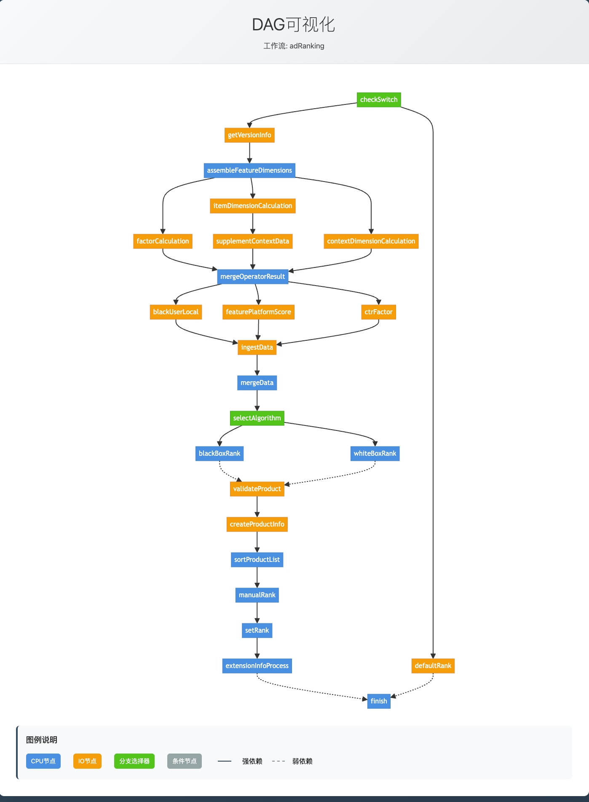

# Flow Orchestrator 接入文档

## 1. 快速开始

> 注：框架兼容并支持JDK21和JDK25版本，适用于最新的Java运行环境

### 1.1 添加依赖

```xml
<!-- Flow Orchestrator 核心依赖 -->
<dependency>
    <groupId>com.qiao.flow</groupId>
    <artifactId>flow-orchestrator-core</artifactId>
    <version>1.0.0</version>
</dependency>

        <!-- Flow Orchestrator Spring Boot 自动配置 -->
<dependency>
<groupId>com.qiao.flow</groupId>
<artifactId>flow-orchestrator-spring-boot-starter</artifactId>
<version>1.0.0</version>
</dependency>
```

### 1.2 实现线程池配置接口

**重要：框架现在完全外部化线程池管理，需要实现`ThreadPoolConfig`接口**

```java

@Component
public class MyThreadPoolConfig implements ThreadPoolConfig {

    @Override
    public ExecutorService getDagCpuThreadPool() {
        // DAG CPU线程池 - 用于CPU密集型节点
        return new ThreadPoolExecutor(
                Math.max(2, Runtime.getRuntime().availableProcessors()),
                Math.max(2, Runtime.getRuntime().availableProcessors()) * 2,
                60L, TimeUnit.SECONDS,
                new LinkedBlockingQueue<>(200),
                new ThreadFactory() {
                    private int counter = 0;

                    @Override
                    public Thread newThread(Runnable r) {
                        return new Thread(r, "my-dag-cpu-" + (++counter));
                    }
                },
                new ThreadPoolExecutor.CallerRunsPolicy()
        );
    }

    @Override
    public ExecutorService getDagIoThreadPool() {
        // DAG IO线程池 - 虚拟线程，用于IO密集型节点
        ThreadFactory factory = Thread.ofVirtual().name("my-dag-io-", 1).factory();
        return Executors.newThreadPerTaskExecutor(factory);
    }

}
```

### 1.3 配置清理策略（可选）

```yaml
dag:
  cleanup:
    # 启用清理功能（默认true）
    enabled: true

    # 策略配置（可选：AGGRESSIVE, BALANCED, CONSERVATIVE）
    preset: BALANCED

    # 单独配置（可选，会覆盖策略配置）
    eviction-interval-ms: 30000      # 驱逐检查间隔
    evictable-idle-time-ms: 60000    # 空闲可驱逐时间
    scheduler-interval: 300000       # 清理调度间隔
```

## 2. 架构说明

### 2.1 线程池外部化设计

**新架构特点**：

- ✅ **完全外部化**：框架不包含任何硬编码线程池
- ✅ **灵活配置**：外界可针对业务场景优化线程池参数
- ✅ **性能提升**：避免重复创建，减少资源浪费
- ✅ **监控友好**：外界可选择是否使用Cat包装

### 2.2 依赖关系

```
外界应用
    ↓ 实现ThreadPoolConfig接口
框架自动配置
    ↓ 注入线程池到管理器
DAG/OPS模块
    ↓ 使用外部提供的线程池
业务逻辑执行
```

**策略说明**：

- `AGGRESSIVE`：激进策略，适合高QPS场景（15s检查，30s空闲，1分钟清理）
- `BALANCED`：平衡策略，适合一般场景（30s检查，1分钟空闲，5分钟清理）
- `CONSERVATIVE`：保守策略，适合资源敏感场景（60s检查，2分钟空闲，10分钟清理）

## 3. 节点开发

### 3.1 基础节点

#### 普通业务节点

```java

@Component
@NodeConfig(
        workflow = "myWorkflow",
        type = NodeType.IO
)
public class MyNode implements Node<ExampleContext> {

    @Override
    public void execute(ExampleContext input, DagContext context, String nodeId) throws Exception {
        // 节点核心业务逻辑
        // 结果通过context.putData()存储
    }
}
```

#### Start节点（工作流入口）

```java

@Component
@NodeConfig(
        workflow = "myWorkflow",
        type = NodeType.IO,
        start = true  // 标识为开始节点
)
public class StartNode implements Node<ExampleContext> {

    @Override
    public void execute(ExampleContext input, DagContext context, String nodeId) throws Exception {
        // 工作流开始，通常进行初始化工作
        // 结果通过context.putData()存储
    }
}
```

#### End节点（工作流出口）

```java

@Component
@NodeConfig(
        workflow = "myWorkflow",
        type = NodeType.IO,
        end = true  // 标识为结束节点
)
public class EndNode implements Node<ExampleContext> {

    @Override
    public void execute(ExampleContext input, DagContext context, String nodeId) throws Exception {
        // 工作流结束，通常进行收尾工作
        // 结果通过context.putData()存储
    }
}
```

### 3.2 节点类型

#### IO密集型节点 (NodeType.IO)

- **适用场景**：网络请求、数据库查询、文件读写等IO操作
- **执行方式**：使用**虚拟线程**执行，提高并发性能
- **线程池**：外部注入的IO线程池

#### CPU密集型节点 (NodeType.CPU)

- **适用场景**：复杂计算、算法处理、数据处理等CPU密集型操作
- **执行方式**：使用**平台线程**执行，充分利用CPU资源
- **线程池**：外部注入的CPU线程池

### 3.3 依赖关系配置

#### 强依赖（dependsOn）

所有依赖节点完成后才能执行当前节点：

```java

@Component
@NodeConfig(
        workflow = "dataPipeline",
        dependsOn = {UserDataLoader.class, ProductDataLoader.class, OrderDataLoader.class}
)
public class DataAggregatorNode implements Node<ExampleContext> {
    // 需要所有数据源都准备好才能进行聚合处理
}
```

#### 弱依赖（weakDependsOn）

任一依赖节点完成后即可执行当前节点：

```java

@Component
@NodeConfig(
        workflow = "cachePipeline",
        weakDependsOn = {RedisCache.class, LocalCache.class, RemoteCache.class}
)
public class CacheProcessorNode implements Node<ExampleContext> {
    // 任一缓存可用即可执行，支持降级策略
}
```

#### 混合依赖关系

```java

@Component
@NodeConfig(
        workflow = "businessPipeline",
        dependsOn = {AuthValidator.class, FeatureEngine.class, ModelEngine.class},     // 强依赖：必须通过认证，需要特征和模型都准备好
        weakDependsOn = {CacheEngine.class, LogEngine.class}                      // 弱依赖：缓存和日志服务可用性不影响核心业务
)
public class BusinessProcessorNode implements Node<ExampleContext> {
    // 复杂的业务处理逻辑
}
```

## 4. 数据传递

### 4.1 业务上下文传递

**特点**：数据跟随业务上下文流转，生命周期与业务请求一致

```java

@Component
@NodeConfig(
        workflow = "myWorkflow"
)
public class ProducerNode implements Node<ExampleContext> {

    @Override
    public void execute(ExampleContext input, DagContext context, String nodeId) throws Exception {
        // 直接在业务上下文中设置数据
        input.setUserId("12345");
        input.setUserName("testUser");
        // 结果通过context.putData()存储
    }
}

@Component
@NodeConfig(
        workflow = "myWorkflow"
)
public class ConsumerNode implements Node<ExampleContext> {

    @Override
    public void execute(ExampleContext input, DagContext context, String nodeId) throws Exception {
        // 直接使用业务上下文中的数据
        String userId = input.getUserId();
        String userName = input.getUserName();
        // 结果通过context.putData()存储
    }
}
```

### 4.2 框架上下文传递

**特点**：数据存储在DAG框架中，与业务逻辑分离

```java

@Component
@NodeConfig(
        workflow = "myWorkflow"
)
public class DataNode implements Node<ExampleContext> {

    @Override
    public void execute(ExampleContext input, DagContext context, String nodeId) throws Exception {
        // 将数据存储到框架上下文中
        context.putData("processedData", "some processed result");
        // 结果通过context.putData()存储
    }
}

@Component
@NodeConfig(
        workflow = "myWorkflow"
)
public class ProcessNode implements Node<ExampleContext> {

    @Override
    public void execute(ExampleContext input, DagContext context, String nodeId) throws Exception {
        // 从框架上下文中获取数据
        String processedData = context.getData("processedData");
        // 结果通过context.putData()存储
    }
}
```

### 4.3 节点结果传递

**特点**：结果与节点绑定，支持类型安全的数据访问

```java

@Component
@NodeConfig(
        workflow = "myWorkflow"
)
public class CalculateNode implements Node<ExampleContext> {

    @Override
    public void execute(ExampleContext input, DagContext context, String nodeId) throws Exception {
        // 计算并存储结果
        String result = "calculation result";
        context.putNodeResult(nodeId, result);  // 新方式：直接设置业务数据，自动绑定到当前节点
        // 结果通过context.putNodeResult()存储
    }
}

@Component
@NodeConfig(
        workflow = "myWorkflow"
)
public class ResultNode implements Node<ExampleContext> {

    @Override
    public void execute(ExampleContext input, DagContext context, String nodeId) throws Exception {
        // 获取节点结果（新方式：直接获取业务数据，支持类型安全）
        String calculateResult = context.getNodeResult(CalculateNode.class);
        // 结果通过context.getNodeResult()获取
    }
}
```

## 5. 实际示例

### 5.1 广告排序工作流

基于实际代码的广告排序示例：

```java
// 检查开关节点
@Component
@NodeConfig(
        workflow = WorkflowNames.AD_RANKING,
        type = NodeType.IO,
        start = true
)
public class CheckSwitch implements Node<ExampleContext> {
    // 检查业务开关
}

// 默认排序节点
@Component
@NodeConfig(
        workflow = WorkflowNames.AD_RANKING,
        type = NodeType.IO,
        dependsOn = {CheckSwitch.class}
)
public class DefaultRank implements Node<ExampleContext> {
    // 执行默认排序逻辑
}

// 白盒排序节点
@Component
@NodeConfig(
        workflow = WorkflowNames.AD_RANKING,
        type = NodeType.CPU,
        dependsOn = {SelectAlgorithm.class}
)
public class WhiteBoxRank implements Node<ExampleContext> {
    // 执行白盒排序算法
}

// 黑盒排序节点
@Component
@NodeConfig(
        workflow = WorkflowNames.AD_RANKING,
        type = NodeType.CPU,
        dependsOn = {SelectAlgorithm.class}
)
public class BlackBoxRank implements Node<ExampleContext> {
    // 执行黑盒排序算法
}
```

### 5.2 商品排序工作流

```java
// 商品验证节点
@Component
@NodeConfig(
        workflow = WorkflowNames.CRUISE_PRODUCT_RANKING,
        type = NodeType.IO,
        start = true
)
public class ValidateProduct implements Node<ExampleContext> {
    // 验证商品信息
}

// 商品排序节点
@Component
@NodeConfig(
        workflow = WorkflowNames.CRUISE_PRODUCT_RANKING,
        type = NodeType.CPU,
        dependsOn = {ProductScore.class},
        end = true
)
public class ProductRank implements Node<ExampleContext> {
    // 执行商品排序
}
```

## 6. 监控和调试

### 6.1 DAG可视化

访问 `/dag/visualization/{workflowName}` 端点查看指定工作流的DAG结构图。

#### 示例：广告排序DAG

```java

@Service
public class AdRankingService {

    @Autowired
    private DagAutoRunner dagAutoRunner;

    public void processAdRanking(ExampleContext context) {
        // 执行广告排序工作流
        dagAutoRunner.executeWorkflow("adRanking", context);
    }
}
```

**访问地址**：`http://localhost:8080/dag/visualization/adRanking`



## 7. 最佳实践

### 7.1 节点设计原则

1. **单一职责**：每个节点只负责一个明确的业务功能
2. **无状态设计**：节点不应维护状态，所有数据通过上下文传递
3. **异常处理**：合理处理异常，避免影响整个工作流
4. **性能考虑**：根据任务类型选择合适的节点类型（IO/CPU）

### 7.2 依赖关系设计

1. **最小依赖**：只声明必要的依赖关系
2. **弱依赖优先**：对于非关键依赖，优先使用弱依赖
3. **避免循环依赖**：确保DAG结构的有向无环特性
4. **合理分组**：将相关功能节点组织在同一工作流中

### 7.3 线程池配置建议

1. **IO密集型**：使用虚拟线程，提高并发性能
2. **CPU密集型**：使用平台线程，充分利用CPU资源
3. **监控集成**：根据需要选择是否使用Cat包装
4. **资源隔离**：不同业务使用独立的线程池

## 8. 常见问题

### 8.1 依赖注入失败

**问题**：`ThreadPoolConfig`实现类未被Spring扫描到

**解决方案**：

1. 确保实现类添加了`@Component`注解
2. 确保类在Spring扫描路径内
3. 检查包扫描配置

### 8.2 工作流执行失败

**问题**：工作流执行时找不到节点

**解决方案**：

1. 检查`@NodeConfig`注解配置
2. 确认`workflow`名称一致
3. 验证节点类是否被Spring管理

### 8.3 性能问题

**问题**：工作流执行性能不佳

**解决方案**：

1. 检查节点类型配置（IO/CPU）
2. 优化线程池参数
3. 分析依赖关系，减少不必要的等待
